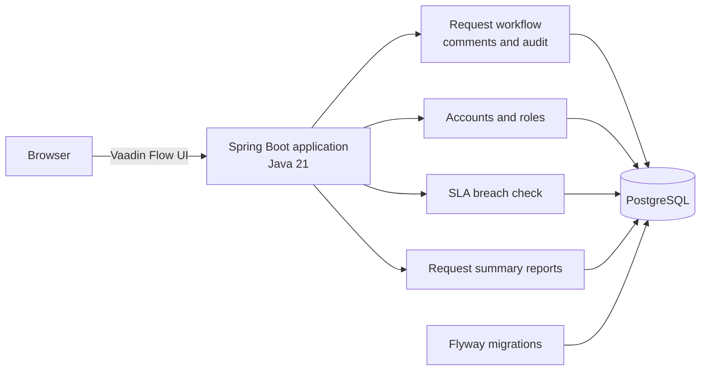

<div align="center">

# Service Desk

**A Java-first internal IT service desk for managing requests from intake to resolution.**

Create and track service requests, coordinate agent work, and keep request history and SLA attention in one place.

[](https://openjdk.org/projects/jdk/21/)
[](https://spring.io/projects/spring-boot)
[](https://vaadin.com/)
[](https://www.postgresql.org/)
[](https://flywaydb.org/)
[](#project-status-and-license)

</div>

## Navigate

| [Overview](#overview) | [Quick start](#quick-start) | [Work with requests](#work-with-requests) | [Accounts and roles](#accounts-and-roles) | [SLA](#service-level-agreement-sla) | [Configuration](#configuration) | [Architecture](#architecture) | [AWS infrastructure](#aws-infrastructure-learning) | [Troubleshooting](#troubleshooting) | [Tests](#tests) | [Status and license](#project-status-and-license) |
| --- | --- | --- | --- | --- | --- | --- | --- | --- | --- |

## Overview

Service Desk is a modular monolith for internal IT support. Its interface and application behavior are written in Java with Vaadin Flow; PostgreSQL stores application data and Flyway manages schema changes.

| Capability | What it does |
| --- | --- |
| **Service requests** | Create, search, filter, assign, and progress internal IT requests. |
| **Role-based access** | Separate requester, agent, and administrator capabilities; requesters only see their own requests. |
| **Comments and history** | Keep request comments and an audit trail of creation, assignment, status changes, comments, and SLA breaches. |
| **SLA attention** | Pause the SLA clock while waiting for the requester, record breaches, and flag them for agent/admin attention. |
| **User administration** | Bootstrap the initial administrator from environment variables; administrators create and manage accounts. |
| **Summary reports** | Show request totals by status and the number of breached requests to agents and administrators. |
| **Compose stack** | Build and run the application with PostgreSQL, health checks, and a persistent database volume. |

## Quick start

### Prerequisites

- Docker Desktop with Docker Compose v2 or newer
- PowerShell on Windows, or a shell where environment variables can be set before running Compose

### Start the application

From the repository root, set a database password and initial administrator credentials in the current PowerShell session, then start the app and database:

```powershell
$env:DATABASE_PASSWORD = '<choose-a-unique-database-password>'
$env:BOOTSTRAP_ADMIN_USERNAME = 'admin'
$env:BOOTSTRAP_ADMIN_PASSWORD = '<choose-a-unique-admin-password>'
docker compose up --build -d
docker compose ps
```

When both services are healthy, open [http://localhost:8080](http://localhost:8080) and sign in using the bootstrap administrator account. The database is stored in a named Docker volume and survives container recreation.

> [!IMPORTANT]
> These example values are placeholders, not credentials. Use strong, unique values and never commit real credentials or an unignored `.env` file.

<details>
<summary>Compose commands and data persistence</summary>

Run these commands from the repository root:

```powershell
docker compose logs -f app
docker compose stop
docker compose down
```

`stop` leaves containers and data in place. `down` removes the containers and network but preserves the database volume. **The following command deletes the database volume and all stored data:**

```powershell
docker compose down -v
```

The application waits for PostgreSQL's health check before starting. Its health check uses the Spring Boot readiness endpoint.

</details>

## Work with requests

1. Sign in with an account created by the administrator.
2. Create a request with a subject, description, and priority.
3. Follow the request's status, comments, assignment, and history in its details.
4. Agents and administrators can search across requests, assign work to an enabled agent or administrator, and perform allowed status transitions.
5. Agents and administrators can filter for SLA attention and view the request summary report.

The supported statuses are `NEW`, `ASSIGNED`, `IN_PROGRESS`, `WAITING_FOR_REQUESTER`, `RESOLVED`, and `CLOSED`. Transitions are validated by the request service; closed requests cannot be assigned or moved to another status.

## Accounts and roles

There is no public registration. The first administrator is created only when the user table is empty. Once accounts exist, changing bootstrap environment variables does not reset or replace them.

| Role | Capabilities |
| --- | --- |
| `REQUESTER` | Create requests and view or comment on their own requests. |
| `AGENT` | Work with all requests, assign requests, change statuses, comment, and view reports. |
| `ADMIN` | Agent capabilities plus user and role administration. |

Administrators can list accounts, create users, enable or disable accounts, and reset passwords. Usernames are immutable, accounts are disabled rather than deleted to preserve history, and the last active administrator cannot be disabled. Passwords are stored as BCrypt hashes.

<details>
<summary>First-run bootstrap and password requirements</summary>

When the database has no users, both `BOOTSTRAP_ADMIN_USERNAME` and `BOOTSTRAP_ADMIN_PASSWORD` must be configured before the application starts. Bootstrap is idempotent for the same existing, active administrator; it does not provision an account over an existing non-empty user database.

Usernames are trimmed, converted to lowercase, and must contain 3–120 letters, numbers, dots, dashes, or underscores. Passwords must be at least 12 characters and at most 72 UTF-8 bytes (the BCrypt input limit).

After signing in, open **Manage users** to create requester, agent, or administrator accounts. An administrator can reset a user's password; the application does not send password-reset email.

</details>

## Service-level agreement (SLA)

- One configurable target applies to all request priorities; the default is **24 hours**.
- Time spent in `WAITING_FOR_REQUESTER` pauses the SLA clock.
- A scheduled check records an SLA breach once in request history and flags the request for agent/admin attention.
- Breaching the SLA does **not** automatically change request priority.
- Breached requests can be filtered, and their count is included in the summary report.

## Configuration

Compose reads variables from the shell or an untracked `.env` file in the repository root. The database password is required.

| Variable | Purpose | Default |
| --- | --- | --- |
| `DATABASE_PASSWORD` | PostgreSQL password for the application and database | Required |
| `POSTGRES_DB` | PostgreSQL database name | `servicedesk` |
| `POSTGRES_USER` | PostgreSQL username | `servicedesk` |
| `BOOTSTRAP_ADMIN_USERNAME` | Username for the initial administrator | Empty; required only when no accounts exist |
| `BOOTSTRAP_ADMIN_PASSWORD` | Password for the initial administrator | Empty; required only when no accounts exist |
| `SLA_TARGET_DURATION` | SLA target duration, using Spring duration syntax such as `24h` or `2d` | `24h` |
| `SERVER_PORT` | Host port mapped to the application | `8080` |

If using a local PostgreSQL instance instead of Compose, also set `DATABASE_URL` and `DATABASE_USERNAME`. The application defaults to `jdbc:postgresql://localhost:5432/servicedesk` and username `servicedesk`.

<details>
<summary>Local development without Docker</summary>

Install JDK 21 and PostgreSQL 15 or newer. The Maven Wrapper downloads and uses the project's configured Maven version. Configure the database and bootstrap environment variables, then run the Spring Boot application from PowerShell:

```powershell
$env:DATABASE_URL = 'jdbc:postgresql://localhost:5432/servicedesk'
$env:DATABASE_USERNAME = 'servicedesk'
$env:DATABASE_PASSWORD = '<your-local-database-password>'
$env:BOOTSTRAP_ADMIN_USERNAME = 'admin'
$env:BOOTSTRAP_ADMIN_PASSWORD = '<choose-a-unique-admin-password>'
.\mvnw.cmd spring-boot:run
```

Flyway applies migrations from [`src/main/resources/db/migration`](src/main/resources/db/migration/); Hibernate validates the schema at startup.

</details>

## Architecture



| Area | Location | Responsibility |
| --- | --- | --- |
| **UI** | [`src/main/java/com/servicedesk/ui`](src/main/java/com/servicedesk/ui/) | Vaadin request, account-management, and sign-in views. |
| **Requests** | [`src/main/java/com/servicedesk/request`](src/main/java/com/servicedesk/request/) | Request entities, workflow rules, comments, audit history, search, and persistence. |
| **Accounts** | [`src/main/java/com/servicedesk/user`](src/main/java/com/servicedesk/user/) | Database-backed authentication, bootstrap administrator, and admin account management. |
| **SLA and security** | [`src/main/java/com/servicedesk/sla`](src/main/java/com/servicedesk/sla/), [`src/main/java/com/servicedesk/config`](src/main/java/com/servicedesk/config/) | Scheduled breach checks, SLA settings, and Spring Security configuration. |
| **Reports** | [`src/main/java/com/servicedesk/reporting`](src/main/java/com/servicedesk/reporting/) | Request counts by status and SLA breach totals. |
| **Database** | [`src/main/resources/db/migration`](src/main/resources/db/migration/) | Versioned schema migrations managed by Flyway. |
| **Local stack** | [`compose.yaml`](compose.yaml), [`Dockerfile`](Dockerfile) | Application and PostgreSQL containers, health checks, and persistent database volume. |

## AWS infrastructure learning

The [`infra/terraform`](infra/terraform/) directory contains a learning configuration for a single EC2 Docker host. It creates a small VPC and public subnet, installs Docker and Docker Compose, and grants the instance Systems Manager access. The instance security group has **no inbound rules**; use Systems Manager Session Manager rather than opening SSH.

The [application CI workflow](.github/workflows/app-ci.yml) runs tests, builds the Docker image, and smoke-tests the app with PostgreSQL in a temporary GitHub Actions runner. It does not publish or deploy the image. The Terraform workflow checks formatting and validates the configuration only; it has no AWS credentials and never creates, changes, or destroys AWS resources. Read [`infra/README.md`](infra/README.md) for the architecture, costs, and safe learning steps.

## Troubleshooting

<details>
<summary>The app is still starting or is unhealthy</summary>

Check that the database is healthy and inspect startup logs:

```powershell
docker compose ps
docker compose logs --tail 100 db app
```

Compose waits for PostgreSQL before starting the app. The app readiness check can take longer during the first startup while the production Vaadin frontend is built into the image. If code has changed, rebuild with `docker compose up --build -d`.

</details>

<details>
<summary>I cannot sign in with the bootstrap credentials</summary>

Bootstrap credentials are used only when the database contains no user accounts. If the database already has users, the bootstrap variables do not change existing passwords. Sign in with an existing administrator account and reset the password from **Manage users**. Do not use `docker compose down -v` unless you intentionally want to delete all database data.

</details>

<details>
<summary>Database connection or migration error</summary>

Check that `DATABASE_PASSWORD` is set and review `docker compose logs db app`. Flyway owns the schema migrations; avoid manually changing the schema. For local development, confirm `DATABASE_URL`, `DATABASE_USERNAME`, and `DATABASE_PASSWORD` point to a reachable PostgreSQL instance.

</details>

<details>
<summary>I refreshed the browser but do not see a UI update</summary>

A browser refresh does not rebuild the application image. From the repository root run `docker compose up --build -d`, wait until `docker compose ps` reports the app as healthy, then reload [http://localhost:8080](http://localhost:8080). The regular `docker compose down` command preserves the database volume.

</details>

## Tests

Run the automated test suite with the Maven Wrapper:

```powershell
.\mvnw.cmd test
```

Tests use an isolated in-memory H2 database in PostgreSQL compatibility mode and do not require a running PostgreSQL server or Docker. To build the application package, run `.\mvnw.cmd -B package`. To validate the Compose file, set a temporary `DATABASE_PASSWORD` environment variable and run `docker compose config --quiet`.

## Project status and license

**Status:** MVP in active development. The repository contains request workflows, persistent accounts and roles, admin-managed user lifecycle, SLA breach tracking, summary reports, and a Docker Compose development stack. The automated tests use H2; use PostgreSQL-backed Compose for local end-to-end verification.

**License:** No `LICENSE` file is currently present, so the repository does not specify reuse or distribution terms. Contact the repository owner before reusing or redistributing this software.
