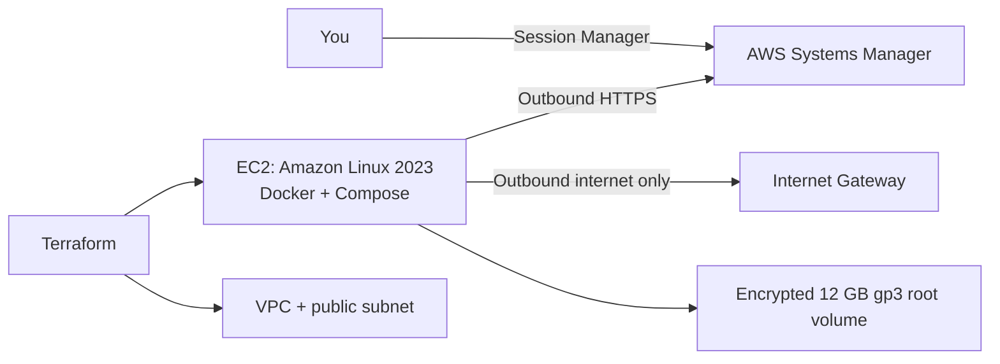

# AWS infrastructure learning

This directory is a first Terraform exercise for the [ServiceDesk application](../README.md). The configuration describes one small EC2 host with Docker and Docker Compose; it does **not** deploy the application yet.

## Architecture



The instance has a public IPv4 address so it can download operating-system packages and connect outbound to Systems Manager, but the security group allows no inbound traffic. Do not add an SSH or application ingress rule as part of this learning setup. An eventual app access/deployment design should add HTTPS deliberately rather than expose port 8080.

The database is not moved to AWS in this first step. The application deployment, secrets handling, and CI/CD release pipeline are also intentionally left for later; the existing Compose stack remains the local development environment.

## Cost and safety

Terraform itself and its local formatting/validation checks do not incur AWS charges. If created and left running, the EC2 instance, its 12 GB encrypted EBS volume, and its public IPv4 address incur charges. For a small `t3.micro` in `eu-central-1`, budget roughly **$10–25/month** before tax and unusual data transfer; check the current [EC2](https://aws.amazon.com/ec2/pricing/on-demand/) and [EBS](https://aws.amazon.com/ebs/pricing/) prices and your account's Free Tier or credit eligibility before any deployment. AWS credits or free usage depend on the account and may expire.

There is no NAT Gateway, load balancer, RDS database, or Kubernetes cluster in this starter configuration. The root disk is deleted when the instance is terminated, so do not treat it as durable application-data storage.

**No AWS resources have been created.** The application CI workflow runs tests, then builds and smoke-tests the app with PostgreSQL on a temporary GitHub Actions runner. It removes the containers and test database volume afterward; it does not publish or deploy the image. The Terraform workflow runs `terraform fmt`, `terraform init -backend=false`, and `terraform validate` without AWS credentials; it never runs `plan` or `apply`. Do not run `terraform apply` unless you have separately reviewed the plan, confirmed the expected cost and AWS account, and explicitly approved deployment. Destroying the instance deletes its root disk and data.

## Learn and validate without AWS

Install Terraform 1.6 or newer. From the repository root in PowerShell:

```powershell
Set-Location .\infra\terraform
Copy-Item .\terraform.tfvars.example .\terraform.tfvars
terraform fmt -check -recursive
terraform init -backend=false
terraform validate
```

The example region is `eu-central-1`; change it in your untracked `terraform.tfvars` if needed. These commands format and validate configuration and download the AWS provider. They do not create cloud resources. The CI workflow runs the same checks automatically for relevant pull requests and pushes to `main`.

The local Terraform state is intentionally not committed. Do not commit `terraform.tfvars`, credentials, state files, or saved plans. Before any future deployment, decide how to protect and share Terraform state; a remote state backend is not configured here.

## Next learning steps

1. Understand the VPC, subnet, route table, security group, EC2 instance profile, and Systems Manager role in `terraform/`.
2. Review a Terraform plan only after selecting and confirming the AWS account, region, and budget.
3. Separately design application image publishing and deployment, HTTPS access, secrets, and database persistence.
4. Add an AWS deployment workflow only after explicitly agreeing on its permissions and a human approval gate.
